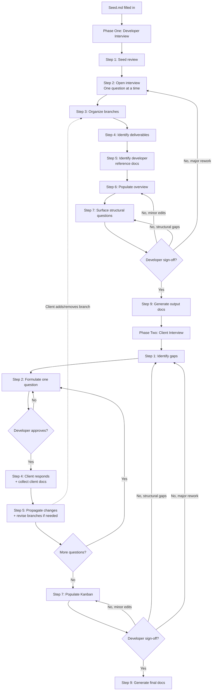

# Process Flow Diagram

<!--
This file contains the Mermaid flowchart for the project planning process.
It's extracted from `process.md` so the agent doesn't pay the context cost
of loading a diagram it can't render.

Developer: Open this file in VS Code's Markdown preview (Ctrl+Shift+V) to
see the rendered diagram.
-->

## Full Process Flow

